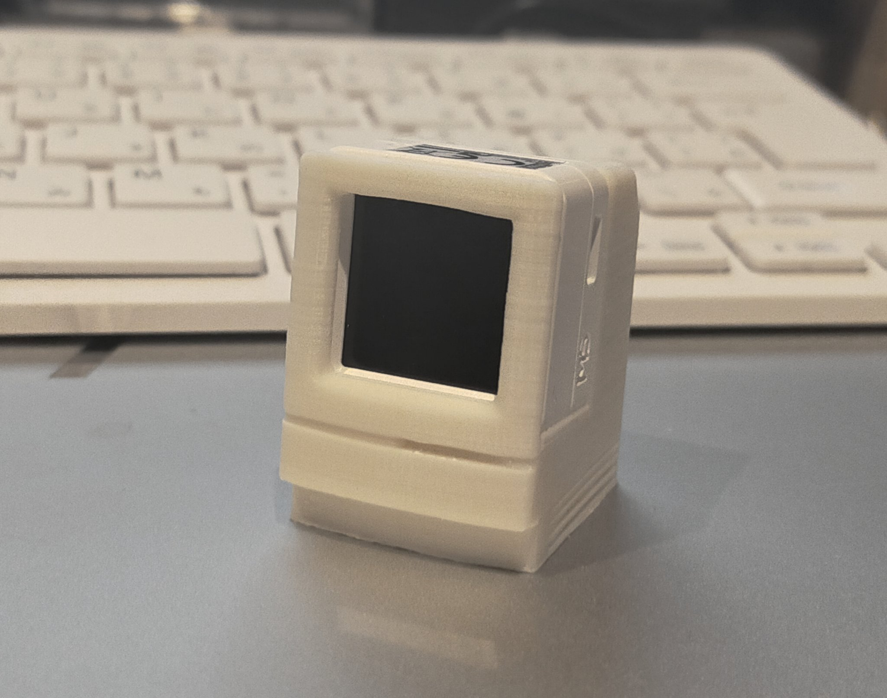

# M5Stack_Stand

## Sample Program (Arduino IDE)

### Required libraris
- M5Unified v0.1.1
- M5Stack-Avatar v0.8.2

### M5 Atom S3
[m5stack avater for ATOM-S3](examples/m5stack_avater-S3)

[Happy Mac & Sad Mac for ATOM-S3](examples/m5atom-S3-sadmec)

## STL data 
### Classic Mac Stand for M5 ATOM-S3
<https://www.thingiverse.com/thing:5794170>
